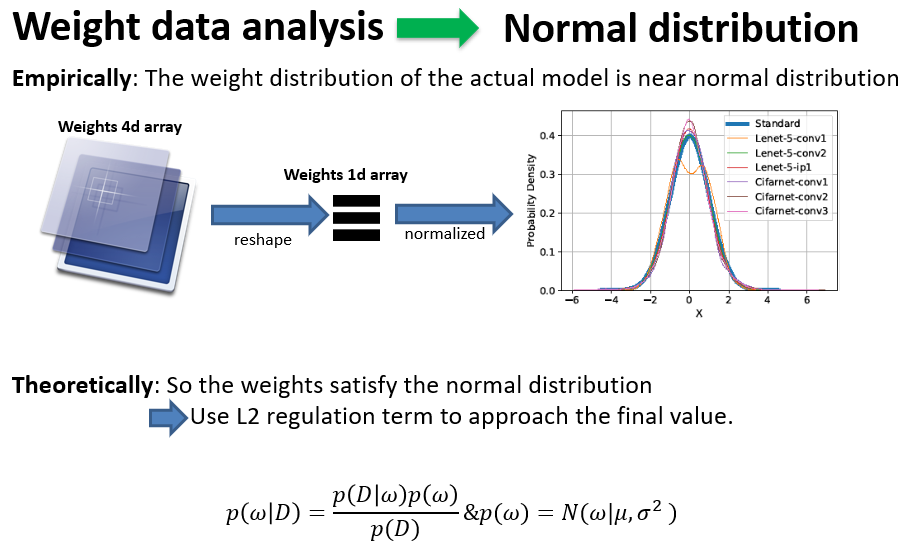
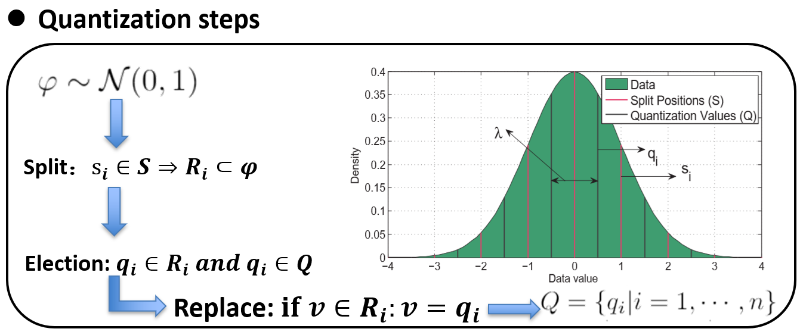
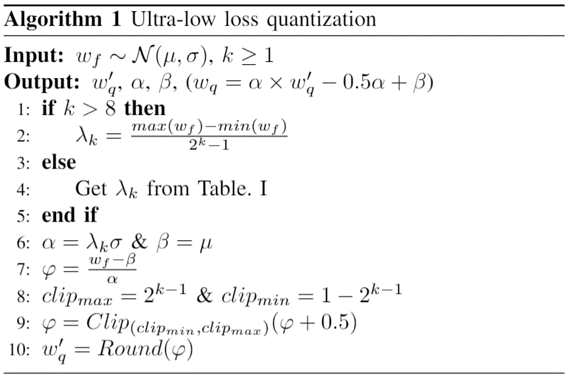
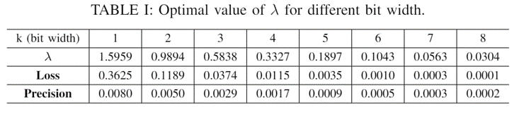
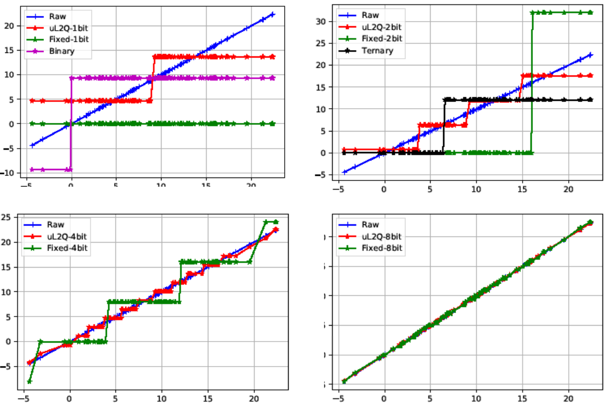
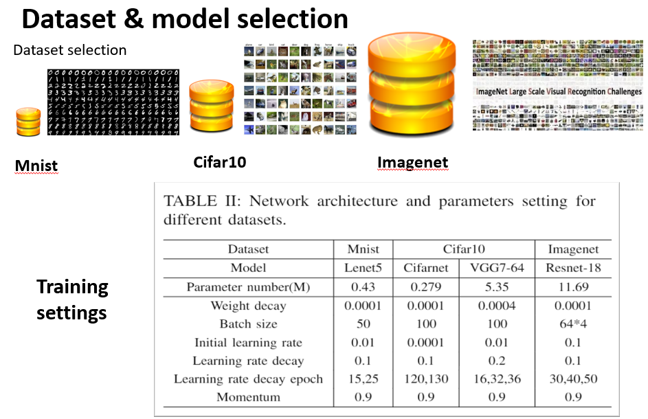
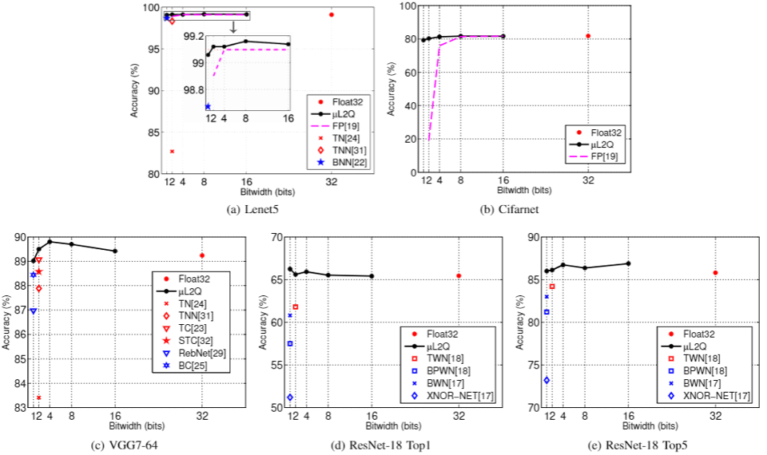
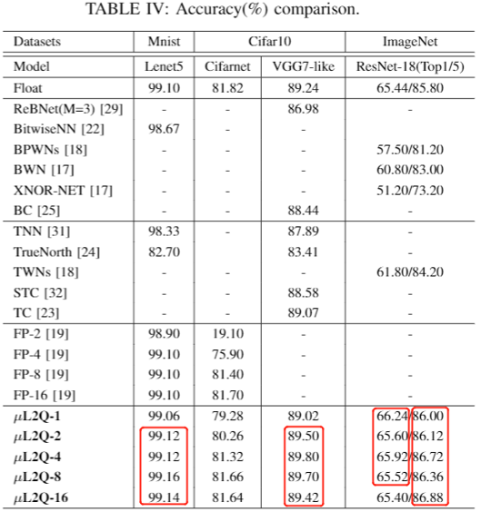

# $\mu$L2Q: An Ultra-Low Loss Quantization Method for DNN Compression

## This method has been merged into [Quantization-caffe](https://github.com/GongCheng1919/Quantization-caffe). 
Please go to [Quantization-caffe](https://github.com/GongCheng1919/Quantization-caffe) for detail information..

## $\mu$L2Q quantization method
- Firstly, by analyzing the data distribution of the model, 
we find that the weight distribution of most models obeys the 
normal distribution approximately, and the regularization term 
based on theoretical deduction (L2) also shows that the weight 
of the model will be constrained to approach the normal distribution 
in the training process.

- Based on the analysis of model weight distribution, 
our method quantifies uniformly (\lambda interval) data $\varphi$ with standard normal 
distribution to discrete value set Q, and minimize the 
L2 distance before and after quantization.


## Algorithm



## DNN Training
- Using the gradient of quantization weight to approximate the gradient of full precision weight


## Experiments
Our experiment is divided into two parts: simulation data evaluation and model testing.
### Simulation data evaluation
- We generate normal distribution data, then quantize the data with different binary 
quantization methods, and draw data curves before and after quantization. It can be 
seen that our quantization method is closest to the original data after quantization.

### Model testing
- We select three representative datasets and four models with different sizes.

- The experimental results are the comparison of the same model output accuracy，which
 quantized by different quantization methods (Binary, Ternary and fixed-point). 



### License
Copyright (c) <2019>
<Nankai University, Tianjin, China>
<Advanced Digital Sciences Center, Singapore>
<University of Illinois at Urbana-Champaign>
All rights reserved.


General terms and conditions for use of the uL2Q design. The design 
comprising "uL2Q" and the documentation provided with them are 
copyright Cheng Gong, Ye Lu, Tao Li, Yao Chen, Deming Chen, 
the Nankai University, Tianjin, China, 
the Advanced Digital Sciences Center, Singapore 
and the University of Illinois at Urbana-Champaign.

Only non-commercial, not-for-profit use of this design is permitted. No part 
of this software design may be incorporated into a commercial product without the 
written consent of the authors.  Similarly, use of 
this software to assist in the development of new commercial applications is 
prohibited, unless the written consent of the authors is obtained.

This software is provided "as is" with no warranties or guarantees of support. 
All users of the software design must take the copy from this site. You may modify or 
use the source code for other non-commercial, not-for-profit research endeavours,
provided that all copyright attribution on the source code is retained, and the
original or modified source code is not redistributed, in whole or in part, or
included in or with any commercial product, except by written agreement with
the authors, and full and complete attribution for use of the code is given in
any resulting publications. Subject to these conditions, the software is
provided free of charge to all interested parties.

When referencing this particular open-source software in a publication, please 
cite the following publication:
Cheng Gong, Ye Lu, Tao Li, Xiaofan Zhang, Cong Hao, Deming Chen and Yao Chen, "uL2Q: An Ultra-low Loss Quantization Method for DNN", The 2019 International Joint Conference on Neural Networks (IJCNN).

### citation
Please cite our works in your publications if it helps your research:
```
@article{cheng2019uL2Q,
  title={$\mu$L2Q: An Ultra-Low Loss Quantization Method for DNN},
  author={Cheng, Gong and Ye, Lu and Tao, Li and Xiaofan, Zhang and Cong, Hao and Deming, Chen and Yao, Chen},
  journal={The 2019 International Joint Conference on Neural Networks (IJCNN)},
  year={2019}
}
```

